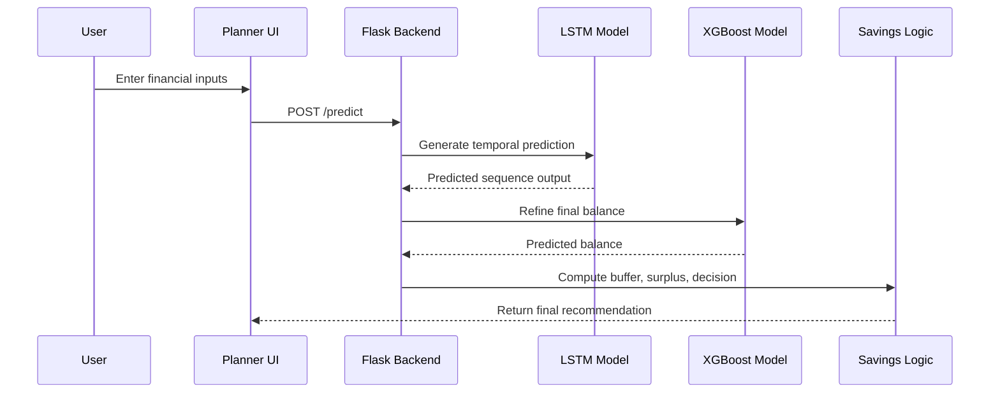
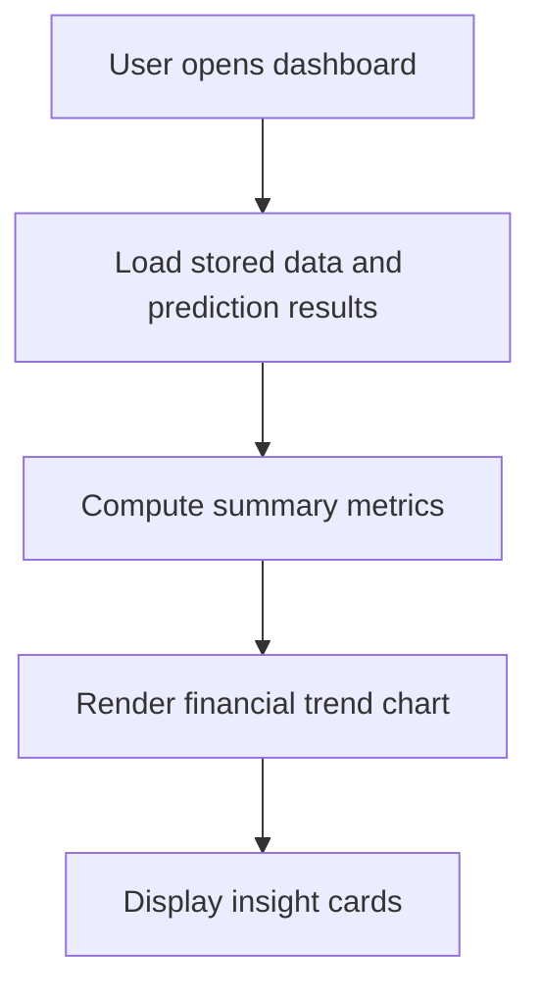
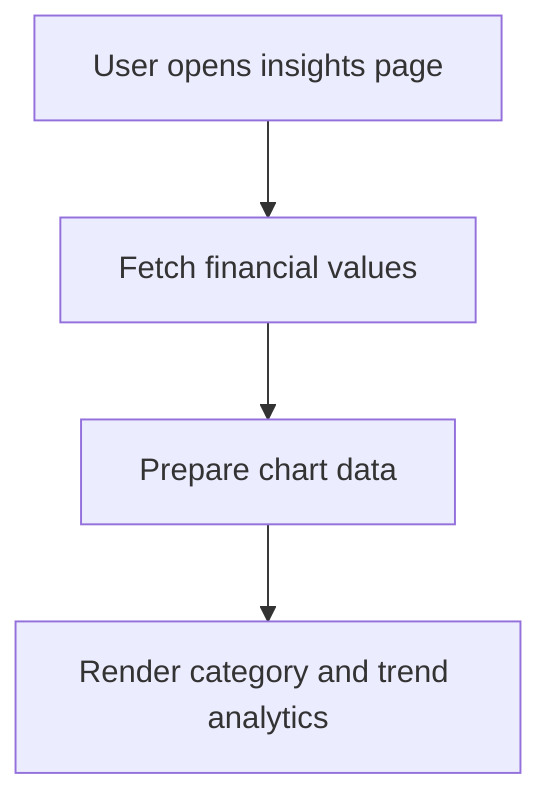
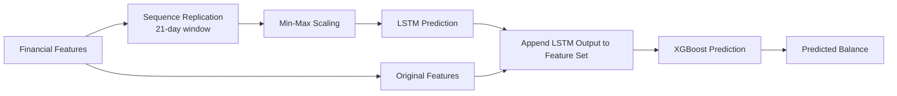
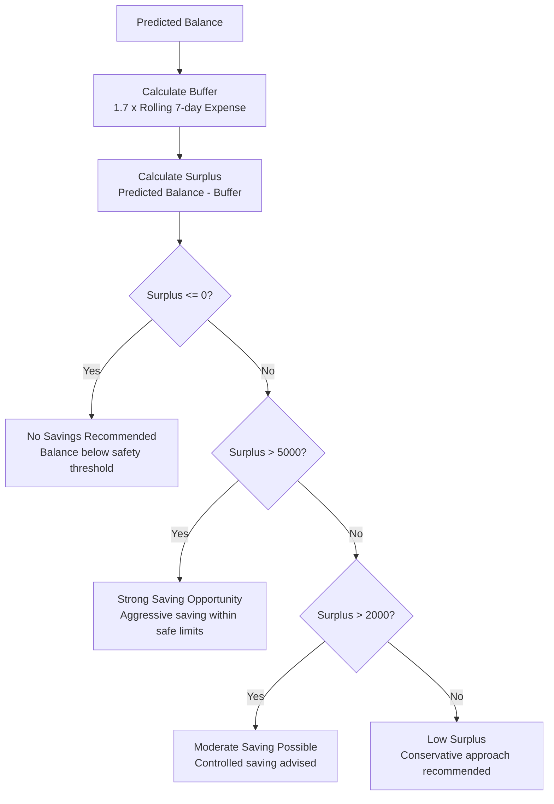

[README (5).md](https://github.com/user-attachments/files/26685778/README.5.md)
# Smart Savings AI

**A Hybrid Deep Learning and Gradient Boosting System for Personalized Financial Savings Recommendations**

Smart Savings AI is a financial intelligence platform that forecasts a user's future account balance and generates personalized, risk-aware savings recommendations. The system is built on a two-stage predictive pipeline that combines a Long Short-Term Memory (LSTM) network for temporal sequence modeling with an XGBoost regressor for structured feature refinement, achieving an R² score of **0.9846** on held-out financial transaction data.

The system was developed as part of a research contribution from the Computer Engineering Department, Kumaraguru College of Technology, Coimbatore, India.

---

## Table of Contents

- [Research Background](#research-background)
- [High-Level Architecture](#high-level-architecture)
- [Repository Structure](#repository-structure)
- [Core Architectural Decisions](#core-architectural-decisions)
- [End-to-End Flows](#end-to-end-flows)
- [Model-Based Prediction Approach](#model-based-prediction-approach)
- [Financial Decision Logic](#financial-decision-logic)
- [Dataset and Feature Engineering](#dataset-and-feature-engineering)
- [Model Performance](#model-performance)
- [API Surface](#api-surface)
- [Frontend Application](#frontend-application)
- [Local Setup](#local-setup)
- [Configuration](#configuration)
- [Current Constraints](#current-constraints)
- [Future Enhancements](#future-enhancements)
- [References](#references)

---

## Research Background

Standard static budgeting methods fail to account for individual behavioral patterns or temporal shifts in spending. This system addresses that gap by proposing a hybrid architecture that captures both sequential dependencies and non-linear feature interactions in personal financial data.

The research compared six regression models across a dataset of **84,000 records** with **26 features** representing user-level financial behavior over time. The key finding is that standalone models, including Linear Regression, Decision Trees, Random Forest, Gradient Boosting, and XGBoost, are individually insufficient for reliable financial forecasting due to the complex non-linear and temporal nature of transaction data.

The proposed hybrid model (LSTM + XGBoost) outperforms all baselines by a statistically significant margin.

**Research Team**

| Name | Role | Institution |
|---|---|---|
| Nivetha R | Associate Professor (Supervisor) | Kumaraguru College of Technology |
| Sakshitha Sree | Research Author | Kumaraguru College of Technology |
| Madhumitha S | Research Author | Kumaraguru College of Technology |

---

## High-Level Architecture


The workflow begins with raw financial inputs that are transformed into structured features. These features are passed through an LSTM model to capture temporal dependencies and forecast the end-of-week balance. The predicted balance is then combined with the original feature set and fed into an XGBoost model, which refines the prediction and drives the savings decision engine.

---

## Repository Structure

```
.
├── app.py                        # Flask application entry point
├── requirements.txt              # Python dependencies
├── xgb_model.pkl                 # Trained XGBoost model
├── lstm_model.h5                 # Trained LSTM model
├── scaler.pkl                    # Min-Max scaler for feature normalization
│
├── static/
│   ├── css/
│   │   └── style.css             # Global stylesheet
│   └── js/
│       ├── script.js             # Core interaction logic
│       └── assistant.js          # AI assistant interface logic
│
└── templates/
    ├── base.html                 # Base layout template
    ├── home.html                 # Landing page
    ├── dashboard.html            # Financial overview dashboard
    ├── planner.html              # Input form and prediction view
    ├── scenario.html             # Scenario-based forecasting
    ├── insights.html             # Analytical insights and charts
    ├── reports.html              # Exportable report view
    ├── assistant.html            # Conversational assistant interface
    └── profile.html              # User profile page
```

---

## Core Architectural Decisions

### Hybrid Model Design

The system combines two complementary learning paradigms:

- **LSTM** captures sequential, temporal dependencies in financial behavior over a fixed 21-day window
- **XGBoost** performs refined regression over structured features, including the LSTM-predicted balance

This combination allows the model to handle both the time-ordered nature of transactions and the non-linear interactions between financial variables.

### Unified Prediction Pipeline

All outputs are generated through a single, consistent pipeline:

```
User Input → Feature Engineering → LSTM Inference → XGBoost Refinement → Savings Logic → Visualization
```

### Deterministic Savings Logic

Recommendation logic is rule-based and interpretable. Every recommendation is derived from a clearly defined surplus calculation, ensuring outputs are financially defensible and stable across edge cases.

---

## End-to-End Flows

### Financial Planner Flow



### Dashboard Flow



### Insights Flow



---

## Model-Based Prediction Approach

### LSTM Model

The LSTM model learns sequential patterns in user financial behavior. It processes time-series input over a fixed window of **21 days** and predicts the end-of-week balance.

LSTM gates governing information flow:

| Gate | Formula | Purpose |
|---|---|---|
| Forget Gate | `f_t = sigmoid(W_f [h_{t-1}, x_t] + b_f)` | Determines which past state to discard |
| Input Gate | `i_t = sigmoid(W_i [h_{t-1}, x_t] + b_i)` | Controls how much new information enters |
| Cell State | `C_t = f_t * C_{t-1} + i_t * C̃_t` | Updates the memory with combined information |

The final hidden state is used to produce the predicted end-of-week balance.

### XGBoost Model

XGBoost builds trees sequentially, with each new tree correcting the errors of the previous one. The objective function balances prediction accuracy and model complexity:

```
Obj = Σ l(y_i, ŷ_i) + Σ Ω(f_k)
```

Where `l` is the mean squared error loss and `Ω` is the regularization term that prevents overfitting.

### Hybrid Inference Pipeline



The final hybrid prediction is expressed as:

```
ŷ_final = f_XGB(x, ŷ_LSTM)
```

---

## Financial Decision Logic

### Emergency Buffer

```
Buffer = 1.7 × Rolling 7-day Expense
```

The buffer accounts for unexpected expenditures and financial uncertainty, ensuring the user retains sufficient liquidity before any savings are recommended.

### Surplus Calculation

```
Surplus = Predicted Balance − Buffer
```

### Safe Saving Amount

```
Safe Saving = Predicted Balance − (Expected Expenses + Buffer)
```

### Decision Rules



---

## Dataset and Feature Engineering

The dataset consists of **84,000 records** with **26 features** representing user-level financial behavior over time.

### Feature Categories

**Lag Features** — Capture historical financial states to model short and long-term dependencies:

| Feature | Description |
|---|---|
| `balance_lag_1` | Balance from 1 day prior |
| `balance_lag_7` | Balance from 7 days prior |
| `expense_lag_1` | Expense from 1 day prior |
| `expense_lag_3` | Expense from 3 days prior |

**Rolling Statistics** — Smooth fluctuations and capture underlying trends:

| Feature | Description |
|---|---|
| `rolling_7_expense` | 7-day rolling average expense |
| `rolling_7_income` | 7-day rolling average income |
| `rolling_3_expense` | 3-day rolling average expense |

**Behavioral Indicators** — Detect patterns and anomalies:

| Feature | Description |
|---|---|
| `spending_spike` | Binary flag for abnormal expenditure |
| `salary_day_flag` | Binary flag for income event |
| `is_weekend` | Binary flag for weekend activity |
| `day_of_week` | Encoded day of the week |
| `days_since_last_income` | Duration since last income event |

All features are normalized using **Min-Max scaling** before model input.

---

## Model Performance

### Comparative Results

| Model | MAE | RMSE | R² |
|---|---|---|---|
| **Hybrid (LSTM + XGBoost)** | **1564.94** | **2702.54** | **0.9846** |
| XGBoost (Standalone) | 1775.67 | 3121.43 | 0.9794 |
| Random Forest | 1755.87 | 3173.55 | 0.9788 |
| Decision Tree | 2427.72 | 4275.31 | 0.9614 |
| Gradient Boosting | 3352.16 | 5753.68 | 0.9302 |
| Linear Regression | 6157.90 | 8632.50 | 0.8428 |

The hybrid model achieves the lowest MAE and RMSE values and the highest R² score across all evaluated architectures, demonstrating statistically meaningful improvements over both classical and ensemble baselines.

### Key Findings

- Linear Regression fails to capture non-linear and temporal relationships, producing the highest error values
- Decision Trees overfit to training data and exhibit poor generalization
- Random Forest and XGBoost handle non-linear relationships effectively but lack temporal awareness
- The hybrid LSTM + XGBoost architecture resolves all identified limitations through integrated sequential and feature-based learning

### Error Analysis

Residual analysis confirms that prediction errors are randomly distributed around zero with no systematic bias. The error distribution follows an approximately normal pattern, indicating reliable generalization across diverse financial scenarios.

---

## API Surface

**Base endpoint**

```
POST /predict
```

**Example Request**

```json
{
  "income": 0,
  "expense": 900,
  "balance": 25000,
  "txn_count": 3,
  "avg_txn": 300,
  "rolling_7_exp": 4000,
  "rolling_7_inc": 30000,
  "lag_exp_1": 1000,
  "lag_exp_3": 200,
  "lag_bal_1": 25900,
  "lag_bal_7": 30000,
  "dow": 1,
  "is_weekend": 0,
  "days_since_inc": 21
}
```

**Example Response**

```json
{
  "current_balance": 25000.0,
  "predicted_balance": 18342.66,
  "emergency_buffer": 6800.0,
  "surplus": 11542.66,
  "savings": 3462.80,
  "message": "Strong saving opportunity"
}
```

---

## Frontend Application

### Financial Planner

- Accept structured financial inputs from the user
- Submit prediction request to the backend
- Display predicted balance, emergency buffer, surplus, recommended savings, and decision message

### Dashboard

- Financial trend visualization over time
- Summary cards for key financial metrics
- Overview of recent prediction history

### Insights

- Spending category breakdown
- Savings opportunity timeline
- Visual interpretation of model outputs including actual vs. predicted balance comparison

---

## Local Setup

### Requirements

- Python 3.10 or above
- pip

### Install Dependencies

```bash
pip install -r requirements.txt
```

### Run Application

```bash
python app.py
```

### Access Application

```
http://127.0.0.1:5000
```

---

## Configuration

The following trained model files must be present in the project root directory before running the application:

| File | Description |
|---|---|
| `xgb_model.pkl` | Trained XGBoost regression model |
| `lstm_model.h5` | Trained LSTM sequence model |
| `scaler.pkl` | Fitted Min-Max scaler for feature normalization |

These files are not included in the repository due to size constraints. They must be generated by running the training pipeline or obtained from the project team.

---

## Current Constraints

- Model files are static and require manual retraining to reflect updated financial data
- Prediction requires manual input from the user via the web interface
- No integration with live banking APIs or real-time data sources
- No user authentication or persistent financial history storage
- No automated retraining pipeline

---

## Future Enhancements

The following improvements are recommended for subsequent development iterations:

1. **User Profile Management** — Persistent financial profiles with historical prediction tracking
2. **Real-Time Data Integration** — Connection to open banking APIs for automated transaction ingestion
3. **Extended Dashboard Analytics** — Additional visualization layers including monthly trends and category-level breakdowns
4. **Scenario-Based Forecasting** — Allow users to simulate financial outcomes under hypothetical spending conditions
5. **Reinforcement Learning Extension** — Enable dynamic model adaptation through continuous learning from user interactions and evolving financial patterns
6. **Mobile-First Deployment** — Progressive web application support for mobile access

---

## References

1. T. Chen and C. Guestrin, "XGBoost: A Scalable Tree Boosting System," *KDD*, 2016, pp. 785–794.
2. S. Hochreiter and J. Schmidhuber, "Long Short-Term Memory," *Neural Computation*, vol. 9, no. 8, pp. 1735–1780, 1997.
3. L. Breiman, "Random Forests," *Machine Learning*, vol. 45, no. 1, pp. 5–32, 2001.
4. J. H. Friedman, "Greedy Function Approximation: A Gradient Boosting Machine," *Annals of Statistics*, vol. 29, no. 5, pp. 1189–1232, 2001.
5. D. P. Kingma and J. Ba, "Adam: A Method for Stochastic Optimization," *ICLR*, 2015.
6. I. Goodfellow, Y. Bengio, and A. Courville, *Deep Learning*, MIT Press, 2016.
7. R. S. Sutton and A. G. Barto, *Reinforcement Learning: An Introduction*, MIT Press, 2018.
8. N. Srivastava et al., "Dropout: A Simple Way to Prevent Neural Networks from Overfitting," *JMLR*, vol. 15, pp. 1929–1958, 2014.
9. R. Hyndman and G. Athanasopoulos, *Forecasting: Principles and Practice*, OTexts, 2018.
10. J. Hull, *Risk Management and Financial Institutions*, Wiley, 2015.

---

